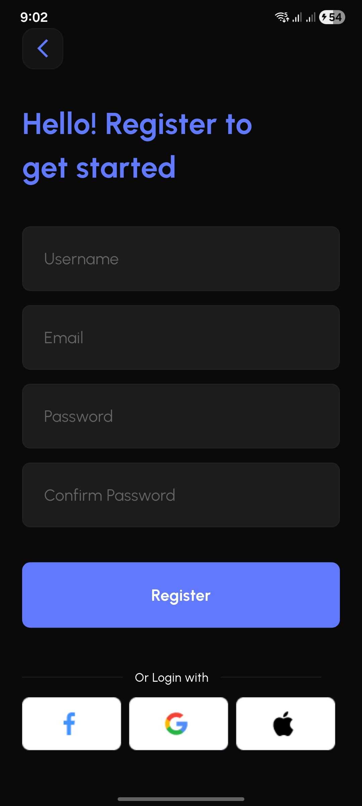
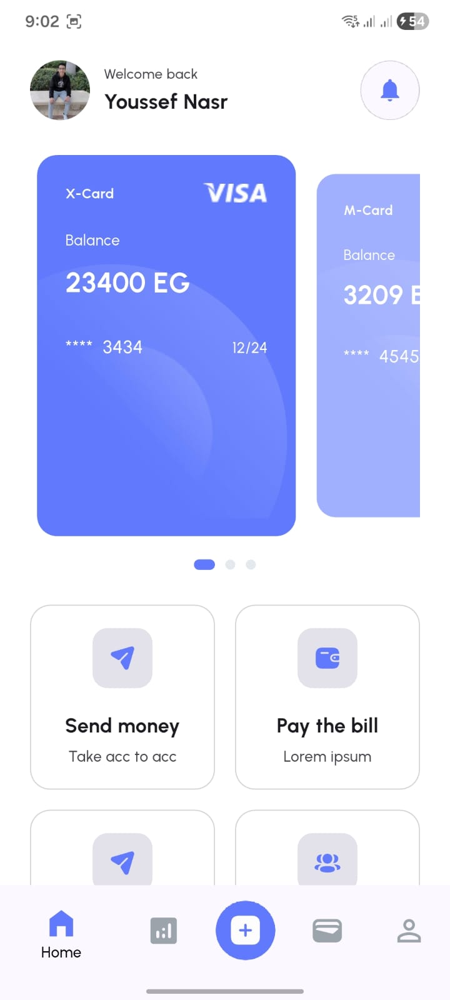
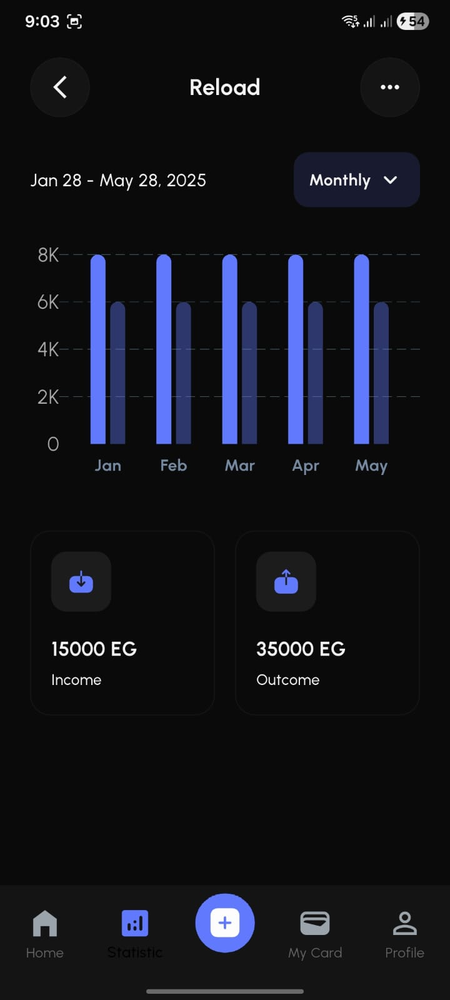

<div align="center">

# 💳 Finance UI — Flutter

A modern **Flutter UI showcase** for a personal finance application built from a real Figma design.  
Focused on **clean UI, reusable components, and pixel-perfect implementation**.

</div>

---

## 📱 Preview

## 📸 More Screenshots

| Screen 1 | Screen 2 | Screen 3 |
|----------|----------|----------|
|  |  |  |

| Screen 4 | Screen 5 |
|----------|----------|
|  |  |

---

## 🚀 Features

- 🎨 Light & Dark Theme System with smooth switching  
- 🧩 Reusable Component-Based Architecture  
- 📐 Pixel-perfect UI from Figma design  
- 📊 Interactive charts using `fl_chart`  
- 📱 Fully responsive design  

---

## 🧠 What I Learned

- Structuring scalable Flutter UI projects  
- Building clean theme systems  
- Converting Figma designs to production UI  
- Writing reusable and maintainable widgets  

---

📁 Project Structure

lib/
├── core/
│   ├── app_widgets/     # Reusable UI components
│   ├── styling/         # Themes, colors, typography
│   └── routing/         # Navigation (go_router)
└── screens/
    ├── features/
    │   └── auth/        # Login & Register screens
    ├── home.dart
    ├── cards_page.dart
    ├── main_screen.dart
    └── profile_page.dart

---

📦 Packages Used

- `flutter_screenutil` — responsive UI  
- `go_router` — navigation  
- `carousel_slider` — UI sliders  
- `fl_chart` — charts  
- `flutter_svg` — SVG support  

---

## ⚙️ Getting Started

```bash
git clone https://github.com/YoussefNasr2005/finance_ui.git
cd finance_ui
flutter pub get
flutter run

